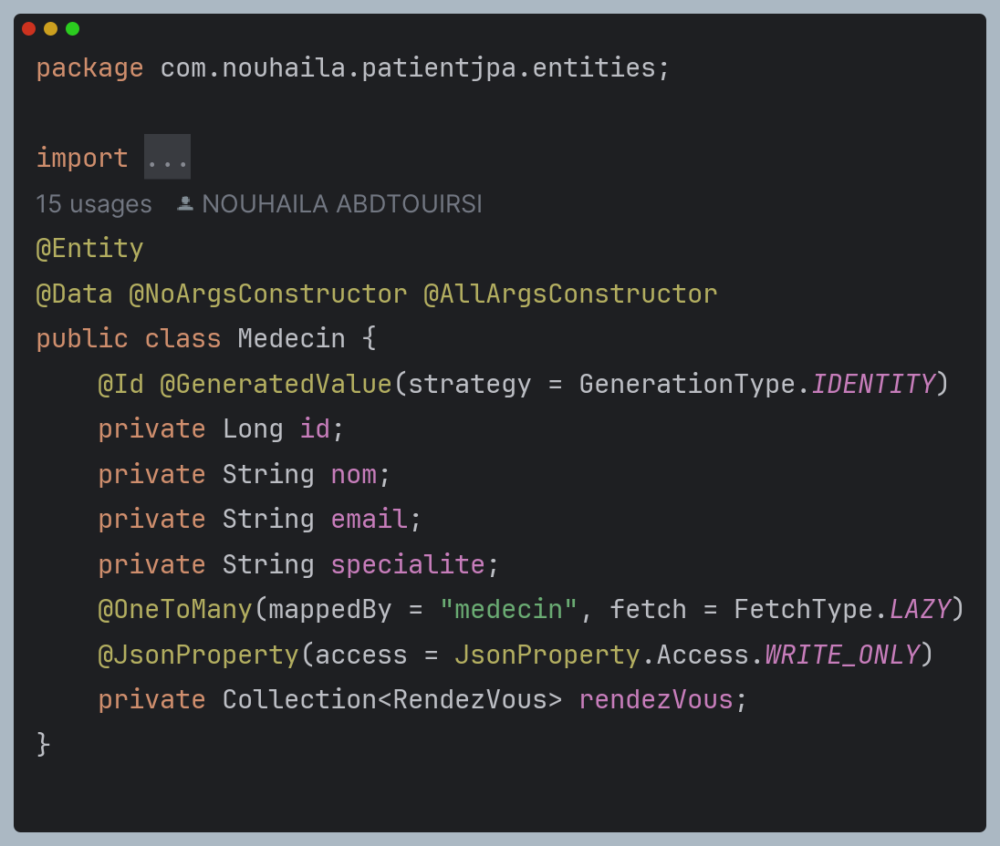

# Manage Patient Using ORM JPA HIbernate SpringData
<h2>Structure de projet : </h2>

## Objectif
### Pre-requis :
1. Installer IntelliJ Ultimate
2. Créer un projet Spring Initializer avec les dépendances JPA, H2, Spring Web et Lombock
## Etapes :
3. Creer d'abord une Enumération Status ayant les valeurs : DONE, PENDING, CANCELED

4. Créer les entités JPA : 
    - Medecin ayant les attributs :
       - id de type Long
       - nom de type String
       - prenom de type String
       - specialite de type String
       - consultations de type List<Consultation>
       - rendezVous de type List<RendezVous>  
         
    - Patient ayant les attributs :
       - id de type Long
       - nom de type String
       - prenom de type String
       - dateNaissance de type Date
       - consultations de type List<Consultation> 
         

     - RendezVous ayant les attributs :
       - id de type Long
       - dateRendezVous de type Date
       - annule de type boolean
       - consultation de type Consultation
       - patient de type Patient
       - status de type Enum (DONE, PENDING, CANCELED)
         

   - Consultation ayant les attributs :
       - id de type Long
       - dateConsultation de type Date
       - rapport de type String
       - rendezVous de type RendezVous 
         

5. Configurer l'unité de persistance dans le ficher application.properties

6. Créer les interfaces JPA Repository basée sur Spring data
- ConsultationRepository : 

- MedecinRepository : 

- PatientRepository : 

- RendezVousRepository : 

7. Tester quelques opérations de gestion de patients :
    - Ajouter des patients  
    - Ajouter des medecins  
    - Consulter un patient par son id  
    - Consulter un patient par son nom  
    - Consulter un medecin par son nom  
    - Creer un rendez-vous  
    - Lister un rdv(le premier)  
    - Creer une consultation  

